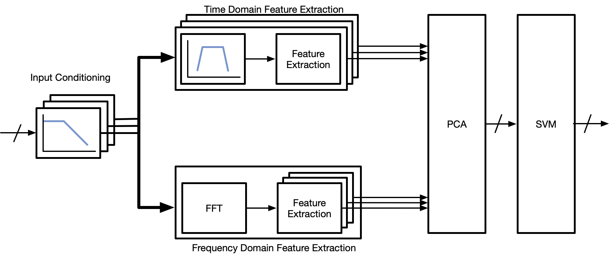
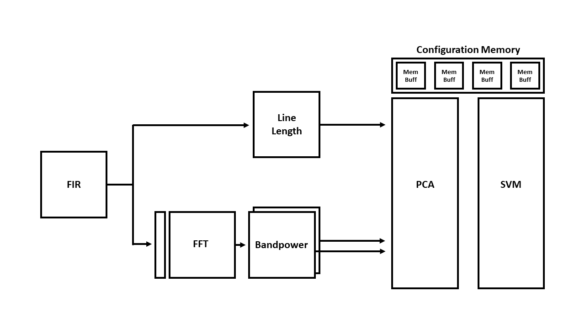

# EE 290C Wellness Monitor: ExG

[](https://travis-ci.org/ucberkeley-ee290c/fa18-wellness-monitor)

## Brief Course Description
The Fall 2018 offering of EE290C, taught by Prof. Borivoje Nikolic, covers digital signal-processing algorithms, architectures and their rapid implementation in advanced technology nodes. The class uses Chisel as a hardware construction language to design a modular baseband/system and connect it to a RISC-V system-on-a-chip. For our final project, we chose to implement a wellness monitor as described below.

## Project Description
The ExG generators describe a tool box of important digital blocks for any arbitrary wellness monitor. The goal of this project is to develop a flow such that any designer could describe a wellness monitor by high level features (e.g. arythmia detection, EEG alpha wave monitoring, siezure detection, etc.) and the generator would build and connect the neccessary filters, FFT blocks, feature extractors, and learning mechanisms required to achieve the high level specification.

An example datapath is shown below:


## Team Members
Adelson Chua, Justin Doong, Ryan Kaveh, Cem Yalcin, and Rachel Zoll

## Generators
1) Filters: 
[FIR](https://github.com/ucberkeley-ee290c/fa18-wellness-monitor/blob/master/doc/firFilter.md), 
[IIR](https://github.com/ucberkeley-ee290c/fa18-wellness-monitor/blob/master/doc/iir.md)
2) FFT:
[FFT Buffer](https://github.com/ucberkeley-ee290c/fa18-wellness-monitor/blob/master/doc/fftbuffer.md), [FFT](https://github.com/ucberkeley-ee290c/fa18-wellness-monitor/blob/master/doc/fft.md)
3) Feature Extractors: 
[Bandpower](https://github.com/ucberkeley-ee290c/fa18-wellness-monitor/blob/master/doc/bandpower.md),
[Line Length](https://github.com/ucberkeley-ee290c/fa18-wellness-monitor/blob/master/doc/linelength.md)
4) [PCA](https://github.com/ucberkeley-ee290c/fa18-wellness-monitor/blob/master/doc/pca.md)
5) [SVM](https://github.com/ucberkeley-ee290c/fa18-wellness-monitor/blob/master/doc/svm.md)
6) [Memory Buffer](https://github.com/ucberkeley-ee290c/fa18-wellness-monitor/tree/master/doc)

## Tape-in 1
For tape-in 1, generators and unit tests were written for FIR and IIR filters, FFT, bandpower, PCA and SVM. These blocks were individually tested and guaranteed working. For integration, because testing functionality would have been very difficult with some incomplete blocks, RocketChip integration was confirmed using just the FIR filter block.

## Tape-in 2
Tape-in 2's primary goal was a more complete integration. Throughout the integration process, several supporting generators were written (Memory Buffer and FFT Buffer) that will connect to the input vectors and matrices for the PCA, SVM, and FFT blocks. Additional feature generators were also constructed (Line Length and a WIP Arythmia Detection). The original blocks were updated to support various new tests and functions (FIR, IIR, FFT, SVM). Finally, a top-level module was written that connects different blocks together for functionality verification. More detail regarding this is presented in the next section.

## How To Set Up and Test The Current Generators
Setting up the generators is straight forward because everything is self-contained. Simply clone the repo and explore the different generators in the [src](https://github.com/ucberkeley-ee290c/fa18-wellness-monitor/tree/master/src/main/scala) folder. Refer to the doc directory [doc](https://github.com/ucberkeley-ee290c/fa18-wellness-monitor/tree/master/doc) for documentation on each generator.

There are multiple ways to test each block and whole designs: unit-tests, SBT-based integration tests, and C code tests that integrate the blocks with a RISC-V Rocket core. An application-based test setup was also developed which goes through SVM training in Python, integrated testing in Scala, and a C-based integration test on a simulated RISC-V environment.

### Unit Tests
Each type-generic generator comes equipped with unit tests which feeds random numbers (either integers or fixed points) to the generators and compare their outputs against golden Scala-based models (all of which are in the [test](https://github.com/ucberkeley-ee290c/fa18-wellness-monitor/tree/master/src/test/scala) directory). 

To run a specific unit test, open SBT and use the 'testOnly' function:

```
testOnly packageName.specName
```
for example:
```
testOnly firFilter.FIRFilterSpec
```

### Wellness Integration Tests
In order to test the entire flow, each block has been connected in an WIP [tester](https://github.com/ucberkeley-ee290c/fa18-wellness-monitor/blob/master/src/test/scala/WellnessIntegrationTester.scala). The current test datapath involves a realistic assortment of different blocks for simple siezure detection. All data is pre-filtered and then split to separate frequency domain and time domain branches. The time domain branch consists of a single line length block (for now) while the frequency domain path involves a serial-to-parallel buffer, FFT and different bandpower blocks. The outputs of the line length and bandpower blocks are fed into a PCA and lastly an SVM. A block diagram for this tester is shown below.



In parallel to the simulated hardware, the integration test also calculates an expected output using a Scala golden model of the entire datapath. The golden model uses all of the smaller unit golden models strung together to build a Scala version of the wellness datapath. 

You can run it as part of the all encompassing SBT 'tests' or a similar testOnly as the unit tests:
```
testOnly wellness.WellnessIntegrationSpec
```

### Rocket Core Integration Tests
Currently there are two C code tests in the [tests](https://github.com/ucberkeley-ee290c/fa18-wellness-monitor/tree/master/tests) directory that both integrate FIR filters with rocket core. [Wellness_TLtest.c](https://github.com/ucberkeley-ee290c/fa18-wellness-monitor/blob/master/tests/wellness_TLtest.c) tests a single writer and reader to/from the 'wellness' block (which is assumed to be a constant coefficient FIR filter. [wellness_IntegrationTest.c](https://github.com/ucberkeley-ee290c/fa18-wellness-monitor/blob/master/tests/wellness_IntegrationTest.c) tests a more substantial version of the 'wellness' block. The C code writes to two queues (that are asynchronous in respect to eachother). One queue feeds into multiple FIR filters while the other feeds into a configuration memory that sets parameters and reference vectors for the PCA and SVM blocks. As data is pushed into the filters, it propogates through to the PCA and then the SVM. Results are read from a read queue and then the C-code will print out the read values and expected values (that are generated using golden C models).

---

### Application-specific and Comprehensive Test Setup
A test framework was developed to enable application-specific testing given some raw data that needs to be classified. To process covers testing starting from SVM training all the way to C tests in a simulated RISC-V environment.

#### SVM training in Python
A [Python script](https://github.com/ucberkeley-ee290c/fa18-wellness-monitor/tree/master/scripts/top.py) performs SVM training from the raw data while also calculating the expected accuracies after the model has been created. This is based on the SVM modelling script discussed [here](https://github.com/ucberkeley-ee290c/fa18-wellness-monitor/tree/master/doc/svm_tutorial.md). All parameters, configuration matrices, and input vectors are then written to different [CSV files](https://github.com/ucberkeley-ee290c/fa18-wellness-monitor/tree/master/scripts/generated_files).

* You would need to extract the [dataset](https://github.com/ucberkeley-ee290c/fa18-wellness-monitor/tree/master/data.zip) to replicate this project. The data folder should be in the main tree ``fa18-wellness-monitor/data/``.

* Setup the configuration parameters in the top level Python script ``top.py``. There are comments in the code which explains what each parameter refers to. You can leave it as is to replicate the results of this project.

* Run the ``top.py``, all configuration files will be saved as CSV in ``fa18-wellness-monitor/scripts/generated_files/``

#### Scala-based testing
The CSV files will then be read by the [top-level tester](https://github.com/ucberkeley-ee290c/fa18-wellness-monitor/blob/master/src/test/scala/WellnessIntegrationTester.scala). The tester sets all submodule generator parameters accordingly and passes an actual input from the test dataset through the datapath chain. Afterwards, the expected values from the SVM classifier and the configuration matrices are written to a [C header file](https://github.com/ucberkeley-ee290c/fa18-wellness-monitor/blob/master/tests/arrays.h).

* Make sure that there are files in the ``fa18-wellness-monitor/scripts/generated_files/`` directory. Else, you would need to run the Python script from the previous section.

* Also make sure that the ``integrated`` flag has been set in the ``WellnessIntegrationSpec.scala``

```
class WellnessIntegrationSpec extends FlatSpec with Matchers {
  behavior of "Wellness"

  // set this to 1 to use the generated files from the Python model
  val integrated = 1
```

* Run the ``WellnessIntegrationSpec`` either as stand-alone or through ``sbt test``. It will generate a C header file named ``fa18-wellness-monitor/tests/array.h``

#### C-based integration test
The C header file will be used in the C integration test where the wellness datapath is already integrated with a RISC-V core. This checks that the expected output from the Python model are consistent and are synthesizeable in hardware.

* Make sure that the ``wellnessParams`` inside the ``fa18-wellness-monitor/src/test/scala/Wellness.scala`` is pointed to ``FixedPointModelWellnessParams``. This gets the parameters from the same files used in the Scala-based test.

```
trait HasPeripheryWellness extends BaseSubsystem {

  val wellnessParams = FixedPointModelWellnessParams
```

* Build the project by running ``make`` inside the ``fa18-wellness-monitor/verisim`` folder. It will take a while. 

* Create the executable for the C tester file ``wellness_IntegrationTest_FixedPoint.c`` by running ``make`` inside the ``fa18-wellness-monitor/tests`` folder. Make sure that the ``Makefile`` points to this C code.

```
PROGRAMS = wellness_IntegrationTest_FixedPoint
```

* Go back to the ``fa18-wellness-monitor/verisim`` folder and run the project:

```
./simulator-freechips.rocketchip.system-DefaultConfig ../tests/wellness_IntegrationTest_FixedPoint.riscv 
```

